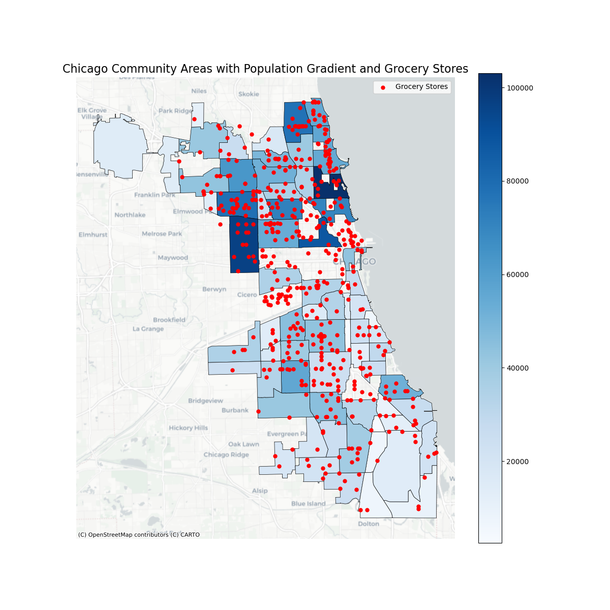
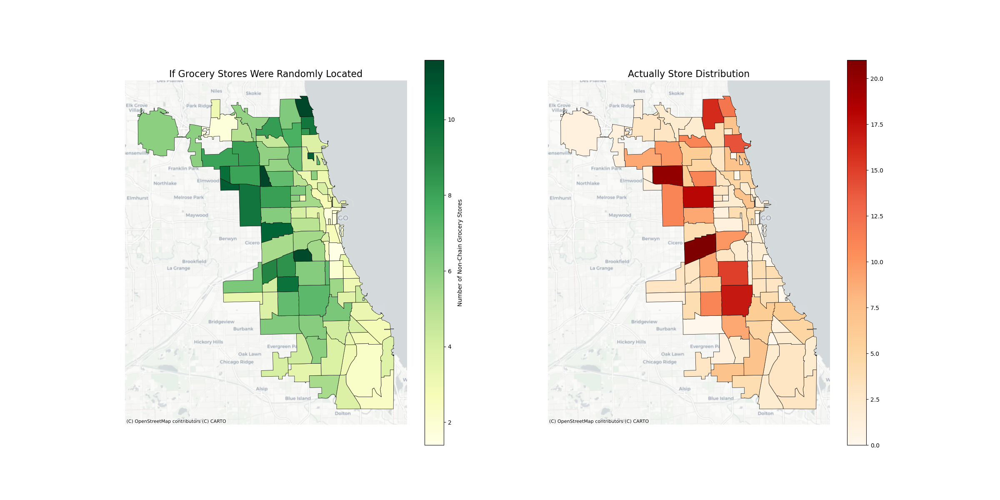
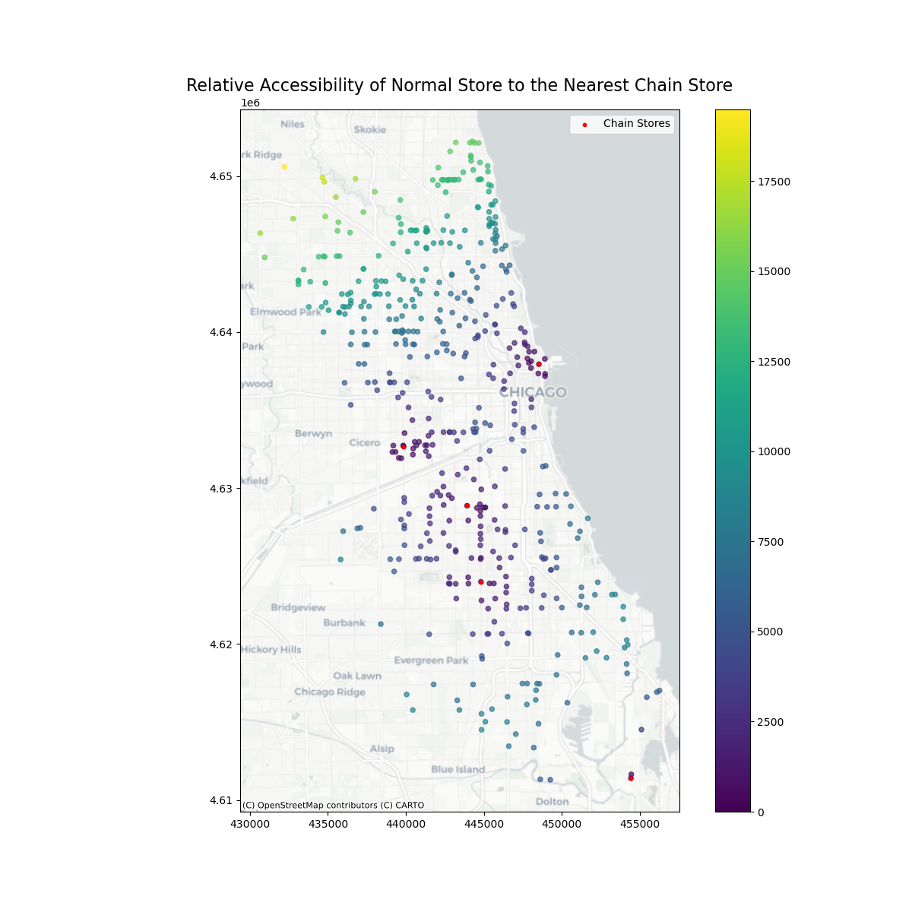
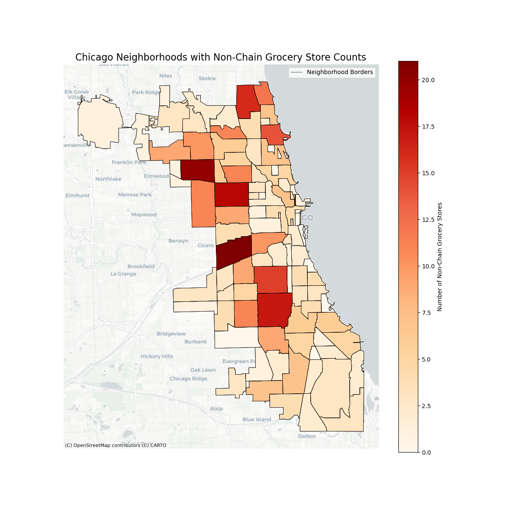
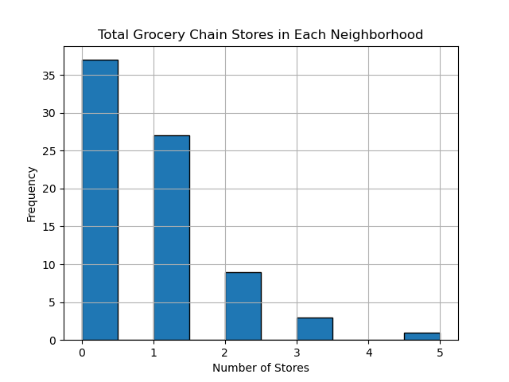

# 📌 Grocery Store Accessibility & Chain Distribution in Chicago: A Spatial Analysis

## Overview  
This project analyzes how grocery stores — with a focus on **grocery chains vs non-chain stores** — are spatially distributed across Chicago community areas. Using geospatial analysis and visualization, the study emphasizes **distance-based access**, **population context**, and **retail structure**, rather than relying solely on store counts.

The goal is to understand how access varies across neighborhoods and to highlight spatial patterns that aggregate statistics can miss.

---

## TL;DR  
- I map grocery stores and population across Chicago community areas.
- I compare observed store locations to a **random placement benchmark**.
- I compute **store-level distance to the nearest grocery chain** using projected CRS.
- Access to grocery chains varies sharply across space and is highly uneven.
- Most neighborhoods have **few or no grocery chains**, even when grocery stores exist.

---

## Key Findings

### 1) Population density and store presence do not perfectly align  
Areas with higher population do not always have proportionally more grocery stores. Several densely populated community areas still show relatively sparse store coverage, indicating that demand alone does not fully explain store placement.



---

### 2) Grocery stores are not randomly distributed across space  
Comparing the actual distribution of grocery stores with a counterfactual random placement shows clear evidence of **spatial clustering**, suggesting that store locations follow systematic patterns rather than uniform coverage.



---

### 3) Proximity to grocery chains varies substantially by location  
Store-level distance to the nearest grocery chain reveals strong spatial gradients. Areas near chain clusters exhibit short distances, while other neighborhoods face substantially longer distances despite having grocery stores present.



---

### 4) Many neighborhoods rely heavily on non-chain grocery stores  
Non-chain grocery stores are unevenly distributed across the city. Some community areas host many non-chain stores, while others have very few, highlighting heterogeneity in retail structure even when food outlets exist.



---

### 5) Grocery chains are rare in most neighborhoods  
The majority of community areas have zero or one grocery chain location. Only a small number of neighborhoods host multiple chain stores, reinforcing the uneven nature of chain access across the city.



---
## How to Run  
1. Clone the repository:
   ```bash
   git clone https://github.com/duongnguyen-t/chicago-grocery-access.git
   cd chicago-grocery-access
2. Install dependencies:
   ``` bash 
   pip install pandas numpy geopandas matplotlib contextily shapely
3. Run notebooks or scripts:
   ``` bash 
   jupyter notebook

---
## Data Sources  
- City of Chicago: Grocery store licensing and location data  
- U.S. Census Bureau (ACS): Population and neighborhood characteristics  
- Chicago Community Area boundary shapefiles  

---

## Methods (High Level)
- Reprojected geographic coordinates to **UTM Zone 16N (EPSG:32616)** to enable accurate distance calculations in meters
- Computed **Euclidean distance** from each grocery store to the nearest chain store
- Aggregated store counts by type (chain vs non-chain) at the community-area level
- Generated a counterfactual random distribution of stores for comparison
- Visualized spatial patterns using consistent color and scale conventions

---

## Technologies Used  
- **Python**: pandas, NumPy  
- **Geospatial Analysis**: GeoPandas, shapely, contextily  
- **Visualization**: matplotlib  
- **Data Processing & EDA**: pandas  

---

## Limitations
- Distances are measured as straight-line (Euclidean) distance, not travel time.
- Store proximity does not capture food quality, pricing, or transportation access.
- The analysis is descriptive and observational; it identifies spatial patterns rather than causal effects.

